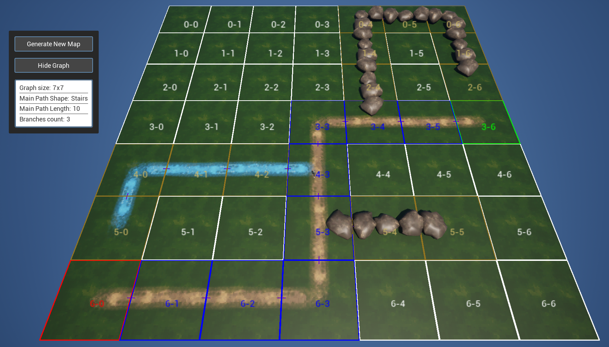

# Procedural Map Generator (Unreal Engine, C++)

## Overview

Tile-based procedural Map Generator I made for an ARPG. The generation has 3 steps:

1. **Graph Generation** - Creates graph with an abstract layout (main path + branches)
2. **Tile Selection** - Matches tiles to graph cells using connector compatibility
3. **World Placement** - Spawns tiles with proper rotation

### Features
- Graph generator creating layout (main path + branches) with configurable path patterns
- Path generator with multiple layout patterns (L, U, Stairs, Square, Straight, etc.)
- Connector system (Path, Wall, River, etc.) for tile neighbor constraints
- Tile selector matching graph cells with  graph constraints
- Weighted random selection for layout and tiles



## How to use it

- Create a AMapGenerator actor and assign a data asset derived from UMapGeneratorConfig to it.
- Create tiles (AMapTile blueprint) which are square pieces of the map. You can add connectors (UMapTileConnector) to the tile to link it to other tiles (link a path, river, wall etc.)
- Create tile templates (UMapTileTemplate blueprint) from tiles
- Assign tile templates to the generator config data asset

1. **Setup Generator** (Blueprint from`AMapGenerator`)
    - Place `AMapGenerator` actor in level
    - Create `UMapGeneratorConfig` data asset and assign it to the generator
    - Customize the configuration. Create and assign a layout config data table (`FMapLayoutConfig` rows)

2. **Create Tiles** (Blueprint from`AMapTile`)
    - Create the visual (meshes, materials, etc.) 
    - Add `UMapTileConnector` components at edges
    - Configure: Direction (North/South/East/West), Type (Path/Wall/River), Theme

3. **Create Tile Templates** (Blueprint from `MapTileTemplate`)
    - Reference tile blueprints
    - Set theme and weight
    - Assign it to generator config data asset

4. **Generate**
   - Call GenerateMap() method from the map generator
```cpp
   MapGenerator->GenerateMap();
```

## Links

- [Portfolio Website](https://paulbeneteau.com)